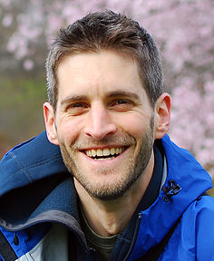

# Neuroscience Institute Faculty

Below are the labs participating in the 2021 Summer Undergraduate Program for Neuroscience Training. If you find a specific lab(s) that you want to work in, you can indicate that in your personal statement. 

## Tritsch Lab

The laboratory of Nicolas Tritsch, PhD, is seeking a full-time research associate to help with our efforts understanding how large ensembles of brain cells make sense of the sensory world to best inform our actions. We use a combination of state-of-the-art experimental approaches in rodents, including multiphoton fluorescence microscopy, high-channel count silicone probe recordings, three-dimensional kinematic analyses, and closed-loop optogenetic manipulations. We are looking for scientifically curious and self-motivated candidates with a bachelor’s degree in mathematics, physics, engineering, or computer science or equivalent to join our team. Candidates with a background in biomedical sciences will be considered provided they have some programming experience. Responsibilities include writing code in MATLAB or Python to analyze and curate large electrophysiological and image-based data sets, contributing to the design and assembly of recording equipment, carrying out and interpreting experiments, presenting findings at meetings, and publishing biomedical research articles. Applicants should be prepared to make a two-year commitment. Learn more about the [Tritsch Lab](https://www.tritschlab.org)
